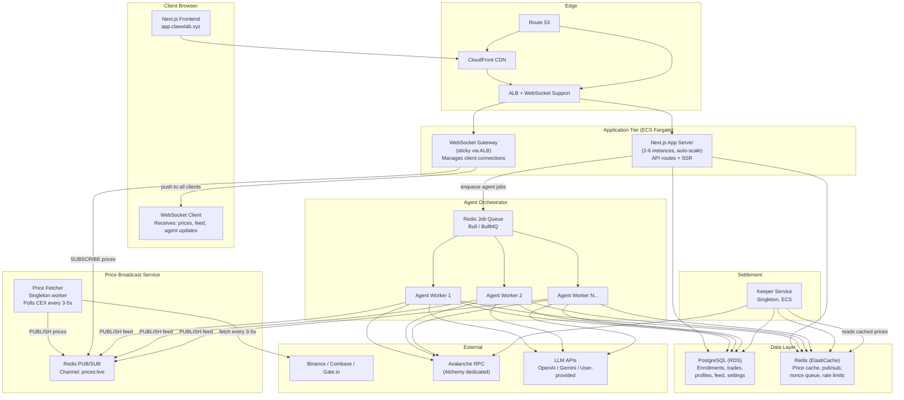
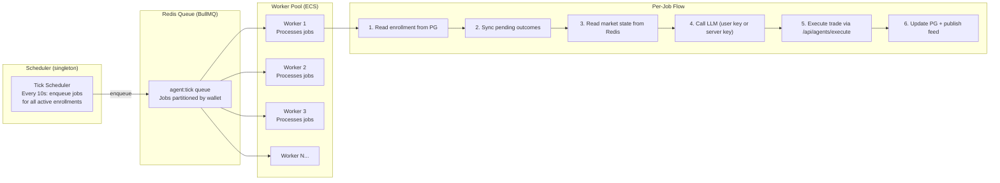
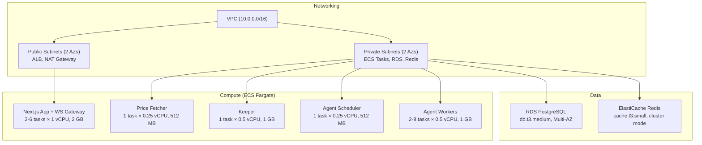

# ClawX — Production Deployment Guide v2 (Revised)

> [!NOTE]
> This is the **revised plan** incorporating your feedback on price broadcasting, agent infrastructure, user-owned LLM keys, and PostgreSQL migration.

---

## 1. Revised System Architecture

### What Changed

| Area | Old Design | New Design |
|------|-----------|------------|
| **Price Data** | Each client polls `/api/prices` on interval; chart built client-side | Backend **Price Service** fetches once, broadcasts to all clients via **WebSocket** |
| **Data Store** | Flat-file JSON (`data/*.json`) | **PostgreSQL** + **Redis** |
| **Agent Runner** | Single `while(true)` loop, sequential | **Worker Pool** with Redis job queue, parallel execution |
| **LLM API Keys** | Single server key in `.env` | Users provide their **own API keys** via Settings panel; server key as fallback |
| **Live Feed** | SSE with file-polling | **WebSocket** (shared connection with price stream) |

### New Architecture Diagram



---

## 2. Price Broadcast Service (New)

### Design

Instead of each client hitting `/api/prices` independently, the backend becomes the **single source of truth** for live prices:

```
┌─────────────────────────────────────────────────────────────┐
│  PRICE FETCHER (singleton worker)                           │
│                                                             │
│  Every 3 seconds:                                           │
│  1. Fetch Binance, Coinbase, Gate.io (parallel)             │
│  2. Compute median price per asset                          │
│  3. Store in Redis: SET price:{symbol} {json} EX 10         │
│  4. Publish: PUBLISH prices:live {all_prices_json}          │
│  5. Build candlestick data points (OHLC per 1m/5m/15m)     │
│     and store in PostgreSQL: INSERT INTO price_candles(...)  │
└─────────────────────────────────────────────────────────────┘
          │
          ▼ Redis PUB/SUB
┌─────────────────────────────────────────────────────────────┐
│  WEBSOCKET GATEWAY (on each Next.js instance)               │
│                                                             │
│  On SUBSCRIBE "prices:live":                                │
│    → Broadcast to all connected WebSocket clients           │
│                                                             │
│  On SUBSCRIBE "feed:messages":                              │
│    → Broadcast agent activity to all connected clients      │
│                                                             │
│  On SUBSCRIBE "agent:{wallet}:update":                      │
│    → Push agent status change to that specific user         │
└─────────────────────────────────────────────────────────────┘
          │
          ▼ WebSocket frames
┌─────────────────────────────────────────────────────────────┐
│  CLIENT BROWSER                                             │
│                                                             │
│  Single WebSocket connection handles:                       │
│  • Live price ticks (every 3s)                              │
│  • Agent feed messages (as they happen)                     │
│  • Personal agent status updates                            │
│  • Chart data (server-built candlesticks)                   │
│                                                             │
│  No polling. No /api/prices calls. Pure push.               │
└─────────────────────────────────────────────────────────────┘
```

### Why WebSocket over WebRTC

| Factor | WebSocket | WebRTC Data Channel |
|--------|-----------|---------------------|
| **Complexity** | Simple — standard HTTP upgrade | Complex — STUN/TURN, ICE negotiation |
| **Server→Client push** | Native, built for this | Designed for peer-to-peer, not server broadcast |
| **ALB Support** | Full support with sticky sessions | No native ALB support |
| **Scalability** | Redis pub/sub + multiple instances | Requires media server (expensive) |
| **Latency** | ~1-5ms over TCP | ~1ms over UDP (marginal gain for price data) |
| **Recommendation** | ✅ **Use this** | Overkill for this use case |

> [!TIP]
> WebSocket gives you the same real-time push behavior you want from WebRTC but with 10× simpler infrastructure. WebRTC shines for voice/video or peer-to-peer, but for server-to-many-clients broadcast of price data, WebSocket is the industry standard (Binance, Coinbase, TradingView all use it).

### New Database Table for Chart Data

```sql
-- Server-built candlesticks (replaces client-side chart construction)
CREATE TABLE price_candles (
  symbol      TEXT NOT NULL,
  interval    TEXT NOT NULL,        -- '1m', '5m', '15m', '1h'
  open_time   TIMESTAMPTZ NOT NULL,
  open        NUMERIC NOT NULL,
  high        NUMERIC NOT NULL,
  low         NUMERIC NOT NULL,
  close       NUMERIC NOT NULL,
  PRIMARY KEY (symbol, interval, open_time)
);
CREATE INDEX idx_candles_lookup ON price_candles(symbol, interval, open_time DESC);
```

### Client Integration

```typescript
// hooks/usePriceStream.ts
export function usePriceStream() {
  const [prices, setPrices] = useState<Record<string, PriceTick>>({});
  
  useEffect(() => {
    const ws = new WebSocket(`wss://app.clawxlab.xyz/ws`);
    
    ws.onmessage = (event) => {
      const msg = JSON.parse(event.data);
      switch (msg.type) {
        case 'prices':
          setPrices(msg.data);  // All assets, every 3s
          break;
        case 'feed':
          // Dispatch to agent feed store
          break;
        case 'agent_update':
          // Dispatch to personal agent panel
          break;
      }
    };
    
    return () => ws.close();
  }, []);
  
  return prices;
}
```

---

## 3. Agent Orchestrator — Worker Pool Architecture (New)

### Why Not a Single Process

The current `agent-runner.js` is a single `for` loop iterating over every enrolled user. At 1,000 users:

| Metric | Single Process | Worker Pool |
|--------|---------------|-------------|
| **Throughput** | ~50 agents/tick (serial) | ~500 agents/tick (parallel) |
| **LLM latency** | 1 slow call blocks everyone | Isolated per worker |
| **Fault tolerance** | Crash = all agents stop | 1 worker crash, others continue |
| **Scaling** | Vertical only | Horizontal (add more workers) |

### Architecture



### Recommended AWS Infrastructure

| Component | Service | Specs | Why |
|-----------|---------|-------|-----|
| **Scheduler** | ECS Fargate (1 task) | 0.25 vCPU, 512 MB | Lightweight cron that enqueues jobs |
| **Workers** | ECS Fargate (auto-scale) | 2-8 tasks × 0.5 vCPU, 1 GB each | Scale based on queue depth |
| **Queue** | Redis (ElastiCache) | Shared with price cache | BullMQ for reliable job processing |

### Auto-Scaling Rules

```yaml
# ECS Service Auto Scaling
agent-workers:
  min_tasks: 2
  max_tasks: 8
  scale_up:
    metric: queue_depth > 100
    cooldown: 60s
  scale_down:
    metric: queue_depth < 10 for 5 minutes
    cooldown: 300s
```

### Job Isolation & Error Handling

```javascript
// Each job is isolated — one failure doesn't affect others
worker.process('agent:tick', async (job) => {
  const { wallet } = job.data;
  try {
    const enrollment = await db.getEnrollment(wallet);
    if (!enrollment || enrollment.paused) return;
    
    // Get user's own LLM key if configured
    const userSettings = await db.getUserSettings(wallet);
    const llmKey = userSettings?.llmApiKey || process.env.AGENT_LLM_API_KEY;
    
    const decision = await decideNextTrade(enrollment, marketState, { llmKey });
    if (decision) await executeTrade(wallet, decision);
  } catch (error) {
    // Log error for this specific agent, don't crash the worker
    logger.error(`Agent ${wallet.slice(0, 8)} failed:`, error.message);
    // Retry with exponential backoff (BullMQ built-in)
    throw error;
  }
});
```

---

## 4. User Settings Panel — Bring Your Own LLM Key (New)

### User-Facing Settings Page

A new `/settings` page (or a panel within `/profile`) where users configure:

```
┌────────────────────────────────────────────────────────┐
│  ◆ AGENT SETTINGS                                      │
│                                                        │
│  LLM Provider                                          │
│  ┌──────────────────────────────────┐                  │
│  │ ▾ Google Gemini (Recommended)   │                  │
│  └──────────────────────────────────┘                  │
│                                                        │
│  API Key                                               │
│  ┌──────────────────────────────────┐  ┌────────┐     │
│  │ AIza•••••••••••••••••••••Xk     │  │ Verify │     │
│  └──────────────────────────────────┘  └────────┘     │
│                                                        │
│  Model                                                 │
│  ┌──────────────────────────────────┐                  │
│  │ gemini-2.0-flash                │                  │
│  └──────────────────────────────────┘                  │
│                                                        │
│  ℹ Your key is encrypted at rest and used exclusively  │
│    for your agent's trading decisions. We never share  │
│    or batch your key with other users.                 │
│                                                        │
│  ┌──────────┐                                          │
│  │  Save    │                                          │
│  └──────────┘                                          │
│                                                        │
│  Status: ✓ Key verified · Last used 2m ago             │
└────────────────────────────────────────────────────────┘
```

### Database Schema

```sql
-- User settings (encrypted API keys)
CREATE TABLE user_settings (
  wallet          TEXT PRIMARY KEY REFERENCES enrollments(wallet),
  llm_provider    TEXT DEFAULT 'gemini',     -- 'gemini', 'openai', 'custom'
  llm_api_key_enc TEXT,                       -- AES-256 encrypted
  llm_model       TEXT DEFAULT 'gemini-2.0-flash',
  llm_base_url    TEXT,                       -- For custom OpenAI-compatible endpoints
  llm_cooldown_sec INTEGER DEFAULT 180,
  key_verified    BOOLEAN DEFAULT false,
  updated_at      TIMESTAMPTZ DEFAULT NOW()
);
```

### API Route: `/api/settings`

```typescript
// pages/api/settings.ts
export default async function handler(req, res) {
  // GET: return settings (key masked: "AIza•••Xk")
  // POST: validate + encrypt + store
  //   1. Verify the key works (test call to LLM with a tiny prompt)
  //   2. Encrypt with AES-256 (key from AWS Secrets Manager)
  //   3. Store encrypted key in PostgreSQL
  //   4. Return { saved: true, verified: true }
}
```

### Key Security

| Concern | Mitigation |
|---------|-----------|
| Key stored in plaintext | **AES-256-GCM encryption** at rest, decryption key in Secrets Manager |
| Key visible in API response | Return only masked version: `AIza•••••Xk` |
| Key used for other users | Each agent worker decrypts only the key for the wallet it's processing |
| Key leaked in logs | Never log the decrypted key; structured logging excludes sensitive fields |

### How It Flows

```
User saves key → API encrypts + stores in PG
                            ↓
Agent Worker picks up job → reads user_settings from PG
                            ↓
                   Decrypts key in-memory (never written to disk)
                            ↓
                   Calls LLM with user's key + user's model choice
                            ↓
                   Falls back to server key if user key fails/missing
```

### Supported Providers (Pre-configured)

| Provider | Base URL | Models | Free Tier |
|----------|----------|--------|-----------|
| **Google Gemini** | `https://generativelanguage.googleapis.com/v1beta/openai` | gemini-2.0-flash, gemini-2.5-flash | 15 RPM free |
| **OpenAI** | `https://api.openai.com/v1` | gpt-4o-mini, gpt-4o | Pay-per-use |
| **Groq** | `https://api.groq.com/openai/v1` | llama-3.3-70b | 30 RPM free |
| **Custom** | User-provided URL | User-provided model | Varies |

---

## 5. PostgreSQL Migration (Confirmed)

### Full Schema

```sql
-- ═══════════════════════════════════════════════════════
-- Core Tables
-- ═══════════════════════════════════════════════════════

CREATE TABLE enrollments (
  wallet            TEXT PRIMARY KEY,
  agent_id          TEXT NOT NULL,
  status            TEXT DEFAULT 'active',
  paused            BOOLEAN DEFAULT false,
  trade_size_tusdc  INTEGER DEFAULT 10,
  agent_memory      JSONB DEFAULT '{}',
  pending_outcomes  JSONB DEFAULT '[]',
  lifetime_tx_count INTEGER DEFAULT 0,
  created_at        TIMESTAMPTZ DEFAULT NOW(),
  last_trade_at     TIMESTAMPTZ
);

CREATE TABLE trade_log (
  id          SERIAL PRIMARY KEY,
  wallet      TEXT NOT NULL,
  round_id    INTEGER NOT NULL,
  side        TEXT NOT NULL,           -- 'UP' | 'DOWN'
  action      TEXT NOT NULL,           -- 'BUY' | 'SELL'
  symbol      TEXT,
  amount      TEXT,                    -- BigInt as string
  hash        TEXT,
  outcome     TEXT,                    -- 'win' | 'loss' | NULL (pending)
  thought     TEXT,                    -- Agent's reasoning
  created_at  TIMESTAMPTZ DEFAULT NOW(),
  settled_at  TIMESTAMPTZ
);
CREATE INDEX idx_trade_wallet ON trade_log(wallet, created_at DESC);
CREATE INDEX idx_trade_round  ON trade_log(round_id);

CREATE TABLE feed_messages (
  id            TEXT PRIMARY KEY DEFAULT gen_random_uuid()::text,
  agent_id      TEXT,
  agent_name    TEXT,
  handle        TEXT,
  color         TEXT,
  text          TEXT NOT NULL,
  kind          TEXT,                  -- 'trade' | 'win' | 'loss' | 'thought'
  pilot_wallet  TEXT,
  pilot_name    TEXT,
  created_at    TIMESTAMPTZ DEFAULT NOW()
);
CREATE INDEX idx_feed_created ON feed_messages(created_at DESC);

CREATE TABLE wallet_profiles (
  wallet        TEXT PRIMARY KEY,
  display_name  TEXT,
  social_links  JSONB DEFAULT '{}',
  updated_at    TIMESTAMPTZ DEFAULT NOW()
);

CREATE TABLE faucet_claims (
  wallet      TEXT PRIMARY KEY,
  last_claim  TIMESTAMPTZ NOT NULL,
  claim_count INTEGER DEFAULT 1
);

-- ═══════════════════════════════════════════════════════
-- New Tables (from revised design)
-- ═══════════════════════════════════════════════════════

CREATE TABLE user_settings (
  wallet           TEXT PRIMARY KEY,
  llm_provider     TEXT DEFAULT 'gemini',
  llm_api_key_enc  TEXT,                    -- AES-256-GCM encrypted
  llm_model        TEXT DEFAULT 'gemini-2.0-flash',
  llm_base_url     TEXT,
  llm_cooldown_sec INTEGER DEFAULT 180,
  key_verified     BOOLEAN DEFAULT false,
  updated_at       TIMESTAMPTZ DEFAULT NOW()
);

CREATE TABLE price_candles (
  symbol      TEXT NOT NULL,
  interval    TEXT NOT NULL,              -- '1m', '5m', '15m', '1h'
  open_time   TIMESTAMPTZ NOT NULL,
  open        NUMERIC NOT NULL,
  high        NUMERIC NOT NULL,
  low         NUMERIC NOT NULL,
  close       NUMERIC NOT NULL,
  volume      NUMERIC DEFAULT 0,
  PRIMARY KEY (symbol, interval, open_time)
);
CREATE INDEX idx_candles_lookup ON price_candles(symbol, interval, open_time DESC);

-- Keeper settlement history (for monitoring)
CREATE TABLE settlement_log (
  id          SERIAL PRIMARY KEY,
  round_id    INTEGER NOT NULL,
  asset_id    INTEGER NOT NULL,
  symbol      TEXT NOT NULL,
  tx_hash     TEXT,
  end_price   TEXT,
  settled_at  TIMESTAMPTZ DEFAULT NOW()
);
```

### Migration Script

A one-time script to import existing JSON data into PostgreSQL:

```javascript
// scripts/migrate-to-postgres.js
// 1. Read data/agent-enrollments.json → INSERT INTO enrollments + trade_log
// 2. Read data/agent-feed.json → INSERT INTO feed_messages
// 3. Read data/wallet-profiles.json → INSERT INTO wallet_profiles
// 4. Read data/faucet-claims.json → INSERT INTO faucet_claims
```

---

## 6. Revised AWS Infrastructure



### Updated Cost Estimate

| Service | Specs | Monthly Cost |
|---------|-------|-------------|
| **Next.js App** (ECS) | 2-6 tasks × 1 vCPU, 2 GB | $70–$200 |
| **Price Fetcher** (ECS) | 1 task × 0.25 vCPU, 512 MB | $8 |
| **Keeper** (ECS) | 1 task × 0.5 vCPU, 1 GB | $15 |
| **Agent Scheduler** (ECS) | 1 task × 0.25 vCPU, 512 MB | $8 |
| **Agent Workers** (ECS) | 2-8 tasks × 0.5 vCPU, 1 GB | $30–$120 |
| **PostgreSQL** (RDS) | db.t3.medium, Multi-AZ, 50 GB | $130 |
| **Redis** (ElastiCache) | cache.t3.small | $25 |
| **ALB** | WebSocket + HTTP routing | $20 |
| **CloudFront** | Static assets, 1 TB | $10 |
| **Alchemy RPC** | Growth plan | $49 |
| **Route 53** | 2 zones | $2 |
| **Secrets Manager** | 6 secrets | $5 |
| **CloudWatch** | Logs + alarms | $15 |
| **NAT Gateway** | For private subnet internet | $35 |
| **LLM (server fallback)** | Gemini Flash, 180s cooldown | ~$50 |
| **Total** | | **~$470–$690/mo** |

> [!NOTE]
> LLM costs drop dramatically as users bring their own keys. If 80% of active users provide their own key, the server LLM budget drops to ~$10/mo.

---

## 7. Revised Implementation Roadmap

### Phase 1: Database Foundation (Week 1-2)

- [ ] Provision RDS PostgreSQL + ElastiCache Redis on AWS
- [ ] Create all database tables (schema above)
- [x] Build a `db/` module wrapping `node-postgres` (connection pooling with `pg-pool`)
- [x] Refactor [store.js](file:///c:/Users/amaym/dev/extPrj/clawX/utils/agents/store.js) — replace all `fs.readFileSync`/`writeFileSync` with SQL queries
- [x] Refactor faucet, profiles, feed to use PostgreSQL
- [ ] Write + run the migration script for existing JSON data
- [x] Add Redis client module (`ioredis`)

### Phase 2: Price Broadcast Service (Week 2-3)

- [x] Extract price fetching from [fastPrice.js](file:///c:/Users/amaym/dev/extPrj/clawX/utils/fastPrice.js) into a standalone worker
- [x] Build candlestick aggregation logic (OHLC per interval)
- [x] Store candles in `price_candles` table
- [x] Implement Redis `PUBLISH prices:live` from the price worker
- [x] Add WebSocket server to the Next.js app (using `ws` library + custom server)
- [x] Subscribe WebSocket gateway to Redis `prices:live` channel
- [x] Build client hook `usePriceStream()` to replace polling
- [x] Migrate chart components to use WebSocket-pushed data
- [x] Remove client-side `/api/prices` polling

### Phase 3: User Settings & LLM Keys (Week 3)

- [x] Create `user_settings` table
- [x] Build `/api/settings` endpoint (GET/POST with AES encryption)
- [x] Build Settings UI panel in the profile page
- [x] Add key verification flow (test LLM call on save)
- [x] Wire agent workers to read user-specific LLM keys
- [x] Add provider selector (Gemini, OpenAI, Groq, Custom)

### Phase 4: Agent Worker Pool (Week 3-4)

- [x] Add `bullmq` dependency
- [x] Build agent scheduler (enqueues `agent:tick` jobs)
- [x] Build agent worker process (processes jobs from queue)
- [x] Implement per-user LLM key decryption in workers
- [x] Add error isolation + retry logic (BullMQ built-in)
- [x] Containerize scheduler + workers separately
- [ ] Deploy to ECS with auto-scaling rules

### Phase 5: Containerization & Deployment (Week 4-5)

- [ ] Write `Dockerfile` for Next.js app (with WebSocket support)
- [ ] Write `Dockerfile` for price-fetcher, keeper, scheduler, worker
- [ ] Create ECS task definitions for all 5 service types
- [ ] Configure ALB with WebSocket support (`stickiness.enabled=true`)
- [ ] Set up CloudFront for landing page (`clawxlab.xyz`)
- [ ] Configure Route 53 DNS
- [ ] Store all secrets in AWS Secrets Manager
- [ ] Set up CI/CD pipeline (GitHub Actions → ECR → ECS deploy)

### Phase 6: Security & Rate Limiting (Week 5)

- [ ] Implement Redis-based rate limiting middleware
- [ ] Add relayer nonce queue (Redis atomic counter)
- [ ] Set up WAF on ALB
- [ ] Configure CORS for cross-subdomain communication
- [ ] Add WebSocket authentication (signed token on connect)
- [ ] Implement connection limits (max 2 WS per IP)

### Phase 7: Testing & Launch (Week 5-6)

- [ ] Load test: 1,000 simulated WebSocket connections
- [ ] Load test: 1,000 agent enrollments processing
- [ ] Load test: concurrent trade relaying (nonce collision test)
- [ ] Monitor query performance (PostgreSQL `pg_stat_statements`)
- [ ] Gradual rollout: 50 → 200 → 500 → 1,000 users
- [ ] Set up CloudWatch dashboards + alerts

---

## 8. Summary of All Changes

| # | Change | Type | Priority |
|---|--------|------|----------|
| 1 | JSON → PostgreSQL migration | Data layer | 🔴 P0 |
| 2 | Add Redis for cache + pub/sub | Data layer | 🔴 P0 |
| 3 | Price Broadcast Service (WebSocket) | New service | 🔴 P0 |
| 4 | Server-built candlestick charts | New feature | 🟡 P1 |
| 5 | Agent Worker Pool (BullMQ) | Architecture | 🟡 P1 |
| 6 | User Settings + BYOK (Bring Your Own Key) | New feature | 🟡 P1 |
| 7 | Relayer nonce queue | Reliability | 🟡 P1 |
| 8 | Containerization (Docker + ECS) | Deployment | 🟡 P1 |
| 9 | Rate limiting middleware | Security | 🟢 P2 |
| 10 | Monitoring + alerting | Operations | 🟢 P2 |

> [!IMPORTANT]
> **Estimated timeline**: 5-6 weeks for one developer. Phases 1-3 are the foundation — nothing else works without the database, price service, and settings infrastructure. Phases 4-5 enable true production scaling. Phases 6-7 harden for real-world traffic.
